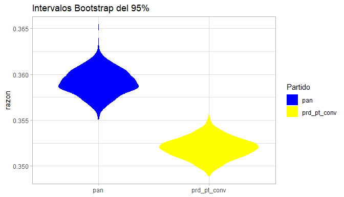

EstComp-Tarea05
================
Bruno C. Gonzalez
15/9/2019

# 5\. Bootstrap

**Conteo rápido**

En México, las elecciones tienen lugar un domingo, los resultados
oficiales del proceso se presentan a la población una semana después. A
fin de evitar proclamaciones de victoria injustificadas durante ese
periodo el INE organiza un conteo rápido. El conteo rápido es un
procedimiento para estimar, a partir de una muestra aleatoria de
casillas, el porcentaje de votos a favor de los candidatos en la
elección.

En este ejercicio deberás crear intervalos de confianza para la
proporción de votos que recibió cada candidato en las elecciones de
2006. La inferencia se hará a partir de una muestra de las casillas
similar a la que se utilizó para el conteo rápido de 2006.

El diseño utilizado es *muestreo estratificado simple*, lo que quiere
decir que:

En este ejercicio (similar al conteo rápido de 2006):

  - Se seleccionó una muestra de \(7,200\) casillas

  - La muestra se repartió a lo largo de 300 estratos.

  - La tabla `strata_sample_2006` contiene en la columna \(N\) el número
    total de casillas en el estrato y en \(n\) el número de casillas que
    se seleccionaron en la muestra, para cada estrato:

  - La tabla `sample_2006` en el paquete `estcomp` (vuelve a instalar de
    ser necesario) contiene para cada casilla:
    
      - el estrato al que pertenece: `stratum`
      - el número de votos que recibió cada partido/coalición: `pan`,
        `pri_pvem`, `panal`, `prd_pt_convergencia`, `psd` y la columna
        `otros` indica el número de votos nulos o por candidatos no
        registrados.
      - el total de votos registrado en la casilla: `total`.

Una de las metodolgías de estimación, que se usa en el conteo rápido, es
*estimador de razón* y se contruyen intervalos de 95% de confianza
usando el método normal con error estándar bootstrap. En este ejercicio
debes construir intervalos usando este procedimiento.

Para cada candidato:

1.  Calcula el estimador de razón combinado, para muestreo estratificado
    la fórmula
es:

\[\hat{p}=\frac{\sum_h \frac{N_h}{n_h} \sum_i Y_{hi}}{\sum_h \frac{N_h}{n_h} \sum_i X_{hi}}\]

Primero hacemos un *join* entre las tablas `sample_2006` y la tabla
`strata_sample_2006` para tener toda la información en la misma tabla,
esta información se guarda en la tabla `sample`.

``` r
library(tidyverse)

sample <- sample_2006 %>% 
  left_join(strata_sample_2006) %>% 
  mutate(w = N/n)
```

Posteriormente se construye la función que calcula el *estimador de
razón* para el partido deseado:

``` r
f_razon <- function(df=sample, part){
  part <- enquo(part)
  
  num <- df %>%
    mutate(v = w*!!part) %>% 
    summarize(sum(v)) %>% 
    as.double()  
  
  den <- df %>%
    mutate(v = w*total) %>% 
    summarize(sum(v)) %>% 
    as.double()
  
  num/den
}
```

Usando la función anterior, calculamos el *estimador de razón* para cada
partido:

``` r
pan <- f_razon(sample, pan)
panal <- f_razon(sample, panal)
prd_pt_conv <- f_razon(sample, prd_pt_conv)
pri_pvem <- f_razon(sample, pri_pvem)
psd <- f_razon(sample, psd)
otros <- f_razon(sample, otros)

razon <- round(c(pan,panal,prd_pt_conv,pri_pvem,psd, otros),4)
names(razon) <- c('pan','panal','prd_pt_conv','pri_pvem','psd', 'otros')

razon
```

    ##         pan       panal prd_pt_conv    pri_pvem         psd       otros 
    ##      0.3592      0.0095      0.3520      0.2232      0.0271      0.0290

2.  Utiliza **bootstrap** para calcular el error estándar, y reporta tu
    estimación del error.
      - Genera 1000 muestras bootstrap.
      - Recuerda que las muestras bootstrap tienen que tomar en cuenta
        la metodología que se utilizó en la selección de la muestra
        original, en este caso, lo que implica es que debes tomar una
        muestra aleatoria independiente dentro de cada estrato.

Creamos una función para generar las muestras y calcular el **estimador
de razón**.

``` r
f_boot <- function(df=sample, part){
  
  part <- enquo(part)
  
  muestra <- df %>% 
    group_by(stratum) %>%
    sample_frac(size = 1, replace = TRUE) %>% 
    ungroup()
  
  f_razon(muestra, !!part)
  
}
```

A continuación se crean las 1000 muestras usando la función anterior.

``` r
mb_pan <- rerun(1000, f_boot(sample, pan)) %>% flatten_dbl()
mb_panal <- rerun(1000, f_boot(sample, panal)) %>% flatten_dbl()
mb_prd_pt_conv <- rerun(1000, f_boot(sample, prd_pt_conv)) %>% flatten_dbl()
mb_pri_pvem <- rerun(1000, f_boot(sample, pri_pvem)) %>% flatten_dbl()
mb_psd <- rerun(1000, f_boot(sample, psd)) %>% flatten_dbl()
mb_otros <- rerun(1000, f_boot(sample, otros)) %>% flatten_dbl()

mb <- tibble(
  pan = mb_pan,
  panal = mb_panal,
  prd_pt_conv = mb_prd_pt_conv,
  pri_pvem = mb_pri_pvem,
  psd = mb_psd,
  otros = mb_otros,
)
```

Así, el error estándard del **estimador de razón** para cada partido es:

``` r
b_se <- map_dbl(mb, sd)
round(b_se,4)
```

    ##         pan       panal prd_pt_conv    pri_pvem         psd       otros 
    ##      0.0014      0.0001      0.0011      0.0010      0.0002      0.0003

3.  Construye un intervalo del 95% de confianza utilizando el método
    normal.

Dados los **estimadores de razón** calculados, y el error estándard
correspondiente, podemos calcular los intercalos para cada partido.

``` r
int_pan <- c(pan+b_se['pan']*qnorm(0.025),
             pan+b_se['pan']*qnorm(0.975))
int_panal <- c(panal+b_se['panal']*qnorm(0.025),
               panal+b_se['panal']*qnorm(0.975))
int_prd_pt_conv <- c(prd_pt_conv+b_se['prd_pt_conv']*qnorm(0.025),
                     prd_pt_conv+b_se['prd_pt_conv']*qnorm(0.975))
int_pri_pvem <- c(pri_pvem+b_se['pri_pvem']*qnorm(0.025),
                  pri_pvem+b_se['pri_pvem']*qnorm(0.975))
int_psd <- c(psd+b_se['psd']*qnorm(0.025),
             psd+b_se['psd']*qnorm(0.975))
int_otros <- c(otros+b_se['otros']*qnorm(0.025),
               otros+b_se['otros']*qnorm(0.975))
```

Repite para todos los partidos (y la categoría otros). Reporta tus
intervalos en una tabla.

``` r
intervalo <- data.frame(pan = int_pan,
                  panal = int_panal,
                  prd_pt_conv = int_prd_pt_conv,
                  pri_pvem = int_pri_pvem,
                  psd = int_psd,
                  otros = int_otros,
                  row.names = c('Inf','Sup')) %>% t(.)

kable(intervalo, caption = 'Intervalos Bootstrap del 95%', digits = 4)
```

|               |    Inf |    Sup |
| ------------- | -----: | -----: |
| pan           | 0.3565 | 0.3619 |
| panal         | 0.0093 | 0.0098 |
| prd\_pt\_conv | 0.3498 | 0.3542 |
| pri\_pvem     | 0.2213 | 0.2252 |
| psd           | 0.0267 | 0.0274 |
| otros         | 0.0283 | 0.0296 |

Intervalos Bootstrap del 95%

De la de información proveniente del **estimador de razón** se puede ver
que que las elecciones de 2006 han sido de las más reñidas en los
últimos años por la cercanía de votos entre el *PAN* y la alianza
*PRD-PT-Convergencia*, al grado de la inestabilidad política que se
generó posteriormente. Sin embargo, a pesar de la cercanía, la
información en los intervalos de confianza no se entrelpa entre sí, lo
que da evidencia suficiente para asegurar triunfo del Partido Accion
Nacional, ver la gráfica de abajo.

``` r
library(ggplot2)

mb %>% 
  pivot_longer(cols = c('pan', 'prd_pt_conv'), 
               names_to = 'Partido', 
               values_to = 'razon') %>% 
  ggplot() +
  geom_violin(aes(x = Partido, y = razon, fill = Partido), color = NA) +
  scale_fill_manual(values = c('blue','yellow')) +
  ggtitle('Intervalos Bootstrap del 95%') +
  xlab(NULL) +
  theme_light()
```

<!-- -->
