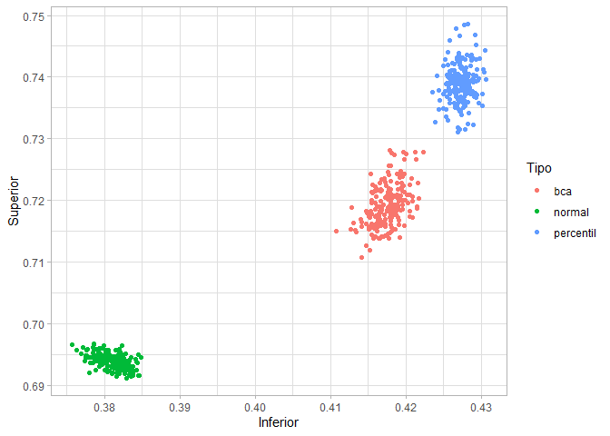

EstComp-Tarea06
================
Bruno C. Gonzalez

## 6\. Más bootstrap

#### 1\. Consideramos la siguiente muestra de los datos de ENLACE:

  - Selecciona el subconjunto de datos de Chiapas (clave de entidad 07):
    
      - Calcula el estimador plug-in para la mediana de las
        calificaciones de matemáticas (en Chiapas).

<!-- end list -->

``` r
enlace_chiapas <- enlace_sample %>% 
  filter(cve_ent == '07')

med_chiapas <- median(enlace_chiapas$mat_3)
paste('El estimador plug-in para la mediana es:',med_chiapas)
```

    ## [1] "El estimador plug-in para la mediana es: 589"

  - Calcula el estimador bootstrap del error estándar y construye un
    intrvalo de confianza normal. Debes 1) tomar muestras bootstrap con
    reemplazo del subconjunto de datos de Chiapas, 2) calcular la
    mediana en cada una de las muestras y 3) calcular la desviación
    estándar de las medianas de 2).

Primero creamos la función para calcular las muestras y la mediana.

``` r
boot_mediana <- function(x){
  n <- length(x)
  m <- sample(x, size = n, replace = TRUE)
  median(m)
}
```

Posteriormente corremos 1000 repeticiones para generar la distribución
bootstrap.

``` r
boot_med_chiapas <- rerun(1000, boot_mediana(enlace_chiapas$mat_3)) %>% flatten_dbl()
```

Ahora calculamos la desviación estándard:

``` r
se_chiapas <- sd(boot_med_chiapas)
paste("La desviación estándard es:", round(se_chiapas,2))
```

    ## [1] "La desviación estándard es: 10.83"

  - Repite los pasos anteriores para la Ciudad de México (clave de
    entidad 09).

Los pasos son equivalentes al ejercicio de Chiapas, solo se presentan
los resultados:

    ## [1] "El estimador plug-in para la mediana es: 619"

    ## [1] "La desviación estándard es: 5.46"

  - Compara los intervalos de
confianza.

<!-- end list -->

``` r
Chiapas <- c(med_chiapas+qnorm(0.025)*se_chiapas, med_chiapas+qnorm(0.975)*se_chiapas)
CDMX <- c(med_cdmx+qnorm(0.025)*se_cdmx, med_cdmx+qnorm(0.975)*se_cdmx)

tabla <- data.frame(Chiapas, CDMX, row.names = c('Inf','Sup')) %>% t(.)

kable(tabla, digits = 2)
```

|         |    Inf |    Sup |
| ------- | -----: | -----: |
| Chiapas | 567.77 | 610.23 |
| CDMX    | 608.29 | 629.71 |

En los intervalos se observa que la Ciudad de Mexico calificaciones de
matemáticas consistentemente mayores que Chiapas. Tambien se puede ver
que el rango del intervalo es mayor en Chiapas, lo que hace pensar que
la enseñansa de matemáticas en Chiapas es muy sensible a factores
externos como si es privada o pública, o si es rural o
urbana.

#### 2\. Intervalos de confianza. En este ejercicio compararemos distintos intervalos de confianza para las medias de una exponencial.

  - Simula una muestra de tamaño 40 de una distribución
    exponencial(1/2).

<!-- end list -->

``` r
muestra_exp <- rexp(40, 1/2)
```

  - Calcula el estimador *plug-in*.

<!-- end list -->

``` r
lambda <- 1/mean(muestra_exp)
paste("El estimador de lambda es:", round(lambda,2))
```

    ## [1] "El estimador de lambda es: 0.55"

  - Calcula intervalos: normal, de percentiles y BC\_a, presentalos en
    una tabla (para los BC\_a usa la función `boot.ci()` del paquete
    `boot`.

Primero creamos la función para calcular las muestras y el estimador.

``` r
boot_lambda <- function(x, ind){
  1/mean(x[ind])
}
```

A continuación creamos las repeticiones para la distribución bootstrap:

``` r
boot_sim_exp <- boot(muestra_exp, boot_lambda, R = 10000)
```

Con esta información podemos calcular los intervalos para *lambda*.

``` r
ints <- boot.ci(boot_sim_exp, type = c("norm", "perc", "bca"))
kable(t(data.frame(ints$normal[,2:3], ints$percent[,4:5],ints$bca[,4:5])), digits = 4)
```

|                   |        |        |
| :---------------- | -----: | -----: |
| ints.normal…2.3.  | 0.3800 | 0.6937 |
| ints.percent…4.5. | 0.4271 | 0.7413 |
| ints.bca…4.5.     | 0.4166 | 0.7212 |

  - Repite los pasos anteriores 200 veces y grafica los intervalos,
    ¿cómo se comparan?

<!-- end list -->

``` r
ints_200 <- map(1:200, ~boot(muestra_exp, boot_lambda, R = 10000)) %>% 
  map(boot.ci, type = c("norm", "perc", "bca"))

ints_norm <- map(ints_200, ~.$normal) %>%
  flatten_dbl() %>%
  matrix(ncol = 3, byrow = TRUE) %>% 
  .[,2:3] %>% 
  as.data.frame()

ints_perc <- map(ints_200, ~.$percent) %>%
  flatten_dbl() %>%
  matrix(ncol = 5, byrow = TRUE) %>% 
  .[,4:5]%>% 
  as.data.frame()

ints_bca <- map(ints_200, ~.$bca) %>%
  flatten_dbl() %>%
  matrix(ncol = 5, byrow = TRUE) %>% 
  .[,4:5]%>% 
  as.data.frame()

ints_norm$tipo <- 'normal'
ints_perc$tipo <- 'percentil'
ints_bca$tipo <- 'bca'

ints <- rbind(ints_norm,ints_perc,ints_bca)
names(ints) <- c('Infe','Sup','Tipo')

ggplot(ints) +
  geom_point(aes(x = Infe, y = Sup, color = Tipo)) +
  labs(x = 'Inferior',
       y = 'Superior') +
  theme_light()
```

<!-- -->

A pesar de que el intervalo normal es el de mayor rango, tambien parece
ser el menos insesgado.
