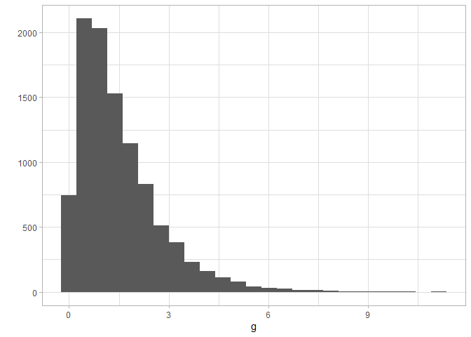
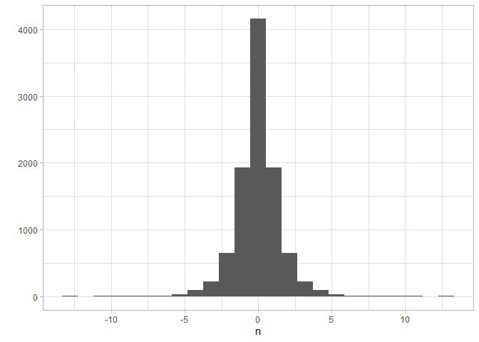

EstComp-Tarea07
================
Bruno C. Gonzalez
13/10/2019

## 7\. Simulación de variables aleatorias

#### Simulación de una Gamma

Usa el método de aceptación y rechazo para generar 1000 observaciones de
una variable aleatoria con distribución gamma(3/2,1).

Primiero definimos la fucnion del cociente entre `f` y `g`

``` r
cociente <- function(x){
  3/2 * 1/base::gamma(3/2) * x ^(1/2)*exp(-x/3)
}
```

Posteriormete definimos la funcion para simular *gamma*

``` r
gamma <- function(){
  
  c <- 1.26
  x <- rexp(1,2/3)
  u <- runif(1)
  while(u>cociente(x)/c){

    u <- runif(1)
    x <- rexp(1,2/3)
  }
  x
}
```

Con lo anterior podemos correr las simulaciones:

``` r
g <- rerun(10000,gamma()) %>% flatten_dbl()
```

La distribucion resultantes se ve de la siguiente manera:

``` r
qplot(g, bins = 25) +
  theme_light()
```

<!-- -->

#### Simulación de una Normal

Implementa el algoritmo de simulación de una variable aleatoria normal
estándar visto en clase (simula 1000 observaciones de una normal
estándar):

Nuestro objetivo es primero, simular una variable aleatoria normal
estándar Z, para ello comencemos notando que el valor absoluto de Z
tiene función de densidad: \[f(x)=\frac{2}{\sqrt{2\pi}}e^{-x^2/2}\] con
soporte en los reales positivos. Generaremos observaciones de la
densidad anterior usando el método de aceptación y rechazo con \(g\) una
densidad exponencial con media 1:

\[g(x)= e^{-x}\]

Ahora, \(\frac{f(x)}{g(x)}=\sqrt{2/\pi}e^{x - x^2/2}\) y por tanto el
máximo valor de \(f(x)/g(x)\) ocurre en el valor \(x\) que maximiza
\(x - x^2/2\), esto ocurre en \(x=1\), y podemos tomar
\(c=\sqrt{2e/\pi}\),
\[\frac{f(x)}{cg(x)}=exp\bigg\{x - \frac{x^2}{2}-{1}{2}\bigg\}\]
\[=exp\bigg\{\frac{(x-1)^2}{2}\bigg\}\]

y por tanto podemos generar el valor absoluto de una variable aleatoria
con distribución normal estándar de la siguiente manera:

1.  Genera \(Y\) una variable aleatoria exponencial con tasa 1.  
2.  Genera un número aleatorio \(U\).  
3.  Si \(U \leq exp\{-(Y-1)^2/2\}\) define \(X=Y\), en otro caso vuelve
    a 1.

Para generar una variable aleatoria con distribución normal estándar
\(Z\) simplemente elegimos \(X\) o \(-X\) con igual probabilidad.

Primero definimos la fucion `f/cg`

``` r
cociente_normal <- function(x){
  exp(((x-1)^2)/2)
}
```

Posteriormente construimos la función para simular el valor absoluto de
la normal

``` r
normal <- function(){
  
  y <- rexp(1,1)
  u <- runif(1)
  
  while(u>cociente_normal(y)){
    y <- rexp(1,1)
    u <- runif(1)
  }
  y
}
```

Con esta fución simulamos la función

``` r
n <- rerun(5000,normal()) %>% flatten_dbl()
```

Con esto construimos la función normal, la cual se comporta de la
siguiente manera:

``` r
n <- c(n,-n)

qplot(n, bins = 25) +
  theme_light()
```

<!-- -->

Su comportamiento parece ser el de una normal.
