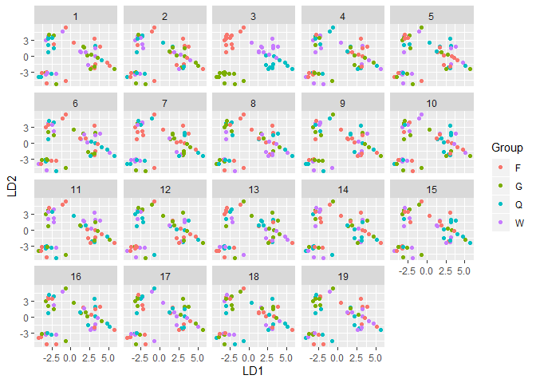
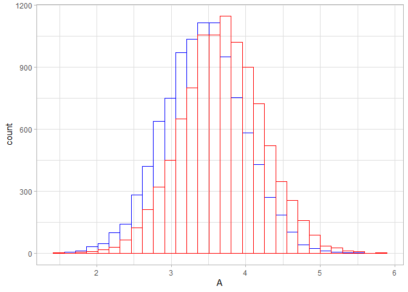
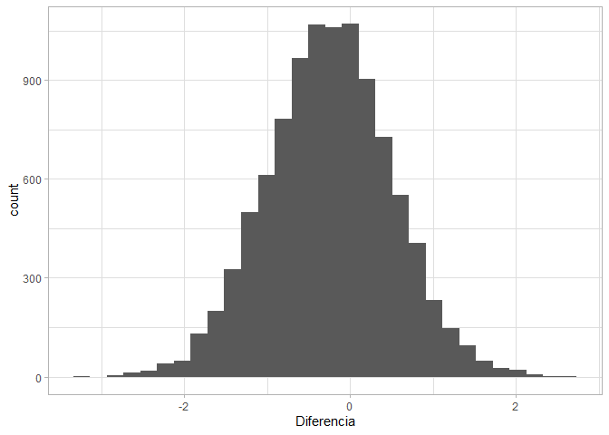
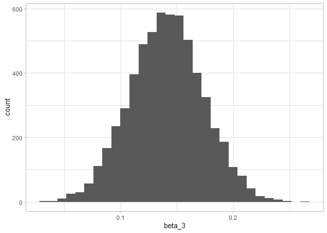

EstComp-Tarea09
================
Bruno C. Gonzalez
27/10/2019

## 9\. Inferencia visual y simulación e modelos

#### 1\. Análisis discriminante

  - Existen métodos de clasificación (supervisados o no supervisados)
    para formar grupos en términos de variables que describen a los
    individuos.

  - Estos métodos (análisis discriminante, o k-means, por ejemplo),
    pretenden formar grupos compactos, bien separados entre ellos.
    Cuando aplicamos el método, obtenemos clasificadores basados en las
    variables de entrada.

  - La pregunta es: ¿los grupos resultantes son producto de patrones que
    se generalizan a la población, o capitalizaron en variación
    aleatoria para formarse?

  - Especialmente cuando tenemos muchas mediciones de los individuos, y
    una muestra relativamente chica, es relativamente fácil encontrar
    combinaciones de variables que separan los grupos, aunque estas
    combinaciones y diferencias están basadas en ruido y no generalizan
    a la población.

En el siguiente ejemplo, tenemos 4 grupos de avispas (50 individuos en
total), y para cada individuo se miden expresiones de 42 genes
distintos.

La pregunta es: ¿Podemos separar a los grupos de avispas dependiendo de
sus mediciones?

Usaremos análisis discriminante para buscar proyecciones de los datos en
dimensión baja de forma que los grupos sean lo más compactos y separados
posibles. Para probar qué tan bien funciona este método, podemos seguir
el protocolo lineup.

Para generar los conjuntos de datos nulos debes permutar lo columna
`Group` de la tabla de datos y repetir los pasos de arriba, realiza esto
19 veces y realizauna gráfica de páneles en la que escondas los datos
verdaderos entre los datos nulos, ¿cuál es tu conclusión?

``` r
set.seed(99)
wasp_null <- lineup(
  null_permute('Group'),
  n = 19,
  true
)


ggplot(wasp_null, aes(x = LD1, y = LD2, colour = Group)) +
  geom_point() +
  facet_wrap(~.sample)
```

<!-- -->

Es claro que los datos verdaderos se encuentran en el panel *3*, por lo
que la clasificación sí es resultado de patrone verdaderos.

#### 2\. Simulación de un modelo de regresión

Los datos beauty consisten en evaluaciones de estudiantes a profesores,
los estudiantes calificaron belleza y calidad de enseñanza para
distintos cursos en la Universidad de Texas. Las evaluaciones de curso
se realizaron al final del semestre y tiempo después \(6\) estudiantes
que no llevaron el curso realizaron los juicios de belleza.

Ajustamos el siguiente modelo de regresión lineal usando las variables
*edad* (age), *belleza* (btystdave), *sexo* (female) e *inglés no es
primera lengua* (nonenglish) para predecir las evaluaciones del curso
(courseevaluation).

``` r
beauty <- readr::read_csv("https://raw.githubusercontent.com/tereom/est-computacional-2018/master/data/beauty.csv")
fit_score <- lm(courseevaluation ~ age + btystdave + female + nonenglish, 
    data = beauty)
```

1.  La instructora \(A\) es una mujer de \(50\) años, el inglés es su
    primera lengua y tiene un puntaje de belleza de \(-1\). El
    instructor B es un hombre de \(60\) años, su primera lengua es el
    inglés y tiene un puntaje de belleza de \(-0.5\). Simula \(1000\)
    generaciones de la evaluación del curso de estos dos instructores.
    En tus simulaciones debes incorporar la incertidumbre en los
    parámetros y en la predicción.

Primero construimos la función que simula las betas usando los
parámetros de la regresión hecha.

``` r
fun_simula_beta <- function(){
  
  df = summary(fit_score)$df[[2]]
  sigma <- summary(fit_score)$sigma*sqrt(df/rchisq(1,df))
  
  beta <- mvrnorm(1, mu = fit_score$coefficients,
                  Sigma = (sigma^2)*summary(fit_score)$cov.unscaled)
  
  list(sigma = sigma, beta =  beta)
  
}
```

Con esta función podemos simular los \(10000\) modelos.

``` r
simula_beta <- rerun(10000, fun_simula_beta())
```

Ahora definimos una función para calcular las calificaciones:

``` r
fun_simula_calif <- function(x, beta, sigma){
  
  mu <- beta[1] + beta[2]*x[1] + beta[3]*x[2] + beta[4]*x[3] + beta[5]*x[4]
  obs <- rnorm(1,mu,sigma)
  
}
```

Ahora podemos simular los puntajes para \(A\) y \(B\).

``` r
simula_puntajes_A <- map(simula_beta,
                       ~fun_simula_calif(
                         x = c(50,-1,1,1),
                         beta = .[['beta']],
                         sigma = .[['sigma']])) %>%
  flatten_dbl()  

simula_puntajes_B <- map(simula_beta,
                         ~fun_simula_calif(
                           x = c(60,-0.5,0,1),
                           beta = .[['beta']],
                           sigma = .[['sigma']])) %>%
  flatten_dbl()
```

Las simulaciones se pueden ver en la siguiente gráfica

``` r
simulacion <- tibble(A = simula_puntajes_A, B = simula_puntajes_B) %>% 
  mutate(Diferencia = A-B)

ggplot(simulacion) +
  geom_histogram(aes(A), color = 'blue', fill = NA) +
  geom_histogram(aes(B), color = 'red', fill = NA) +
  theme_light()
```

    ## `stat_bin()` using `bins = 30`. Pick better value with `binwidth`.
    ## `stat_bin()` using `bins = 30`. Pick better value with `binwidth`.

<!-- -->

  - Realiza un histograma de la diferencia entre la evaluación del curso
    para \(A\) y \(B\).

A continuación el histograma de las diferencias

``` r
ggplot(simulacion) +
  geom_histogram(aes(Diferencia)) +
  theme_light()
```

    ## `stat_bin()` using `bins = 30`. Pick better value with `binwidth`.

<!-- -->

  - ¿Cuál es la probabilidad de que \(A\) obtenga una calificación
    mayor?

De lo anterior podemos sacar la probabilidad de que \(A\) tenga una
calificación mayor:

``` r
sum(simulacion$Diferencia>0)/10000
```

    ## [1] 0.3685

2.  En el inciso anterior obtienes simulaciones de la distribución
    conjunta. Para este ejercicio nos vamos a enfocar en el coeficiente
    de belleza (\(\beta_3\)), realiza \(6000\) simulaciones del modelo
    (como en el inciso anterior) y guarda las realizaciones de
    \(\beta_3\).

Primero hacemos las \(6000\) simulaciones:

``` r
simula_beta3 <- rerun(6000, fun_simula_beta()) %>% 
  map_dbl(~.[['beta']][[3]]) %>% 
  as.data.frame()

names(simula_beta3) <- 'beta_3'
```

  - Genera un histograma con las simulaciones de \(\beta_3\).

Con estos datos podemos generar el histograma

``` r
ggplot(simula_beta3) +
  geom_histogram(aes(beta_3)) +
  theme_light()
```

    ## `stat_bin()` using `bins = 30`. Pick better value with `binwidth`.

<!-- -->

  - Calcula la media y desviación estándar de las simulaciones y
    comparalas con la estimación y desviación estándar del coeficiente
    obtenidas usando `summary`.

Y por último, obtenemos las medias y desviaciones estándard.

``` r
m_b3 <- mean(simula_beta3$beta_3)
sd_b3 <- sd(simula_beta3$beta_3)
m_b3_sum <- summary(fit_score)$coeff[3,1]
sd_b3_sum <- summary(fit_score)$coeff[3,2]
```

En el caso de la media, la simulada 0.1409341 es menor que la obtenidad
con el modelo analítico: 0.1410319. Por el otro lado, la desviación
estándard simulada 0.0324165 es mayor que la obtenida con la regresión
0.0329142. En ambos casos la diferencia es mínima.
