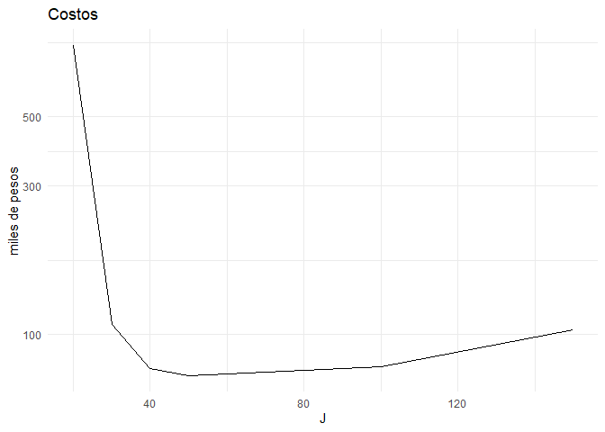

EstComp-Tarea10
================
Bruno C. Gonzalez
4/11/2019

## 10\. Simulación muestra y bootstrap paramétrico

#### Simulación para calcular tamaños de muestra

Supongamos que queremos hacer una encuesta para estimar la proporción de
hogares donde se consume refresco de manera regular, para ello se diseña
un muestreo por conglomerados donde los conglomerados están dados por
conjuntos de hoagres de tal manera que todos los conglomerados tienen el
mismo número de hogares. La selección de la muestra se hará en dos
etapas:

1.  Seleccionamos \(J\) conglomerados de manera aleatoria.

2.  En cada conglomerado seleccionames \(n/J\) hogares para entrevistar.

El estimador será simplemente el porcentaje de hogares del total de la
muestra que consume refresco. Suponemos que la verdadera proporción es
cercana a \(0.50\) y que la media de la proporción de interés tiene una
desviación estándar de \(0.1\) a lo largo de los conglomerados.

1.  Supongamos que la muestra total es de \(n=1000\). ¿Cuál es la
    estimación del error estándar para la proporción estimada si
    \(J=1,10,100,1000\)?

2.  El obejtivo es estimar la propoción que consume refresco en la
    población con un error estándar de a lo más \(2\%\). ¿Que valores de
    \(J\) y \(n\) debemos elegir para cumplir el objetivo al menor
    costo?

Los costos del levantamiento son: + \(50\) pesos por encuesta. + \(500\)
pesos por conglomerado

``` r
muestreo <- function(J, n_total = 1000) {
    n_cong <- floor(n_total / J)
    medias <- rnorm(J, 0.5, 0.1)
    medias <- case_when(
        medias < 0 ~ 0, 
        medias > 1 ~ 1,
        TRUE ~ medias)
    resp <- rbinom(J, n_cong, medias)
    sum(resp) / n_total
}
errores <- tibble(J = c(1, 10, 100, 1000)) %>% 
    mutate(
        sims = map(J, ~(rerun(1000, muestreo(.)) %>% flatten_dbl())), 
        error_est = map_dbl(sims, sd) %>% round(3)
            )
errores
```

    ## # A tibble: 4 x 3
    ##       J sims          error_est
    ##   <dbl> <list>            <dbl>
    ## 1     1 <dbl [1,000]>     0.102
    ## 2    10 <dbl [1,000]>     0.035
    ## 3   100 <dbl [1,000]>     0.018
    ## 4  1000 <dbl [1,000]>     0.016

``` r
tamano_muestra <- function(J) {
    n_total <- max(100, J)
    ee <- rerun(1000, muestreo(J = J, n_total = n_total)) %>% 
        flatten_dbl() %>% sd()
    while(ee > 0.02){
        n_total = n_total + 20
        ee <- rerun(500, muestreo(J = J, n_total = n_total)) %>% 
            flatten_dbl() %>% 
            sd() %>% 
            round(3)
        }
    list(ee = ee, n_total = n_total, costo = 500 * J + 50 * n_total)
}
tamanos <- c(20, 30, 40, 50, 100, 150)
costos <- map_df(tamanos, tamano_muestra)
costos$J <- tamanos
costos
```

    ## # A tibble: 6 x 4
    ##      ee n_total  costo     J
    ##   <dbl>   <dbl>  <dbl> <dbl>
    ## 1 0.02    16720 846000    20
    ## 2 0.02     1860 108000    30
    ## 3 0.02     1160  78000    40
    ## 4 0.019     980  74000    50
    ## 5 0.02      580  79000   100
    ## 6 0.02      570 103500   150

``` r
ggplot(costos, aes(x = J, y = costo / 1000)) +
    geom_line() + scale_y_log10() + theme_minimal() +
    labs(y = "miles de pesos", title = "Costos")
```

<!-- -->
\#\#\#\# Bootstrap paramétrico

2.  Sean \(X_1,...,X_n \sim N(\mu, 1)\). Sea \(\theta = e^{\mu}\),
    simula una muestra de \(n=100\) observaciones usando \(\mu=5\).

<!-- end list -->

  - Usa el método delta para estimar \(\hat{se}\) de \(\hat{\theta}\) y
    crea un intervalo del \(95\%\) de confianza. Pista:
    \(se(\hat{\mu}) = 1/\sqrt{n}\)

Primero estimamos el *se*

``` r
mu <- 5
theta <- exp(mu)
muestra <- rnorm(100, mu, 1)
mu_est <- (mean(muestra))
sd_est <- sd(muestra)

se_tetha <-  exp(mu_est)/sqrt(100)
sim_t <- rnorm(1000,exp(mu_est), se_tetha)
se_tetha
```

    ## [1] 14.71522

Con esta información construimos el intervalo de confianza.

``` r
theta+se_tetha*c(qnorm(0.025), qnorm(0.975))
```

    ## [1] 119.5719 177.2545

  - Repite el inciso anterior usando boostrap paramétrico.

Primero construimos la funcion para el bootstrap parametrica, usando los
pámetros obtenidos anteriormente.

``` r
theta_bootp <- function(){
  m <- rnorm(100, mu_est, sd_est)
  mu_boot <- mean(m)
  sd_boot <- sd(m)
  exp(mu_boot)
}
```

Con esta información podemos hacer la simulación y obtener el intervalo
de confianza.

``` r
sim_bootp <- rerun(1000, theta_bootp()) %>% flatten_dbl()
se_bootp <- sd(sim_bootp)
theta+se_bootp*c(qnorm(0.025), qnorm(0.975))
```

    ## [1] 118.9478 177.8785

  - Finalmente usa bootstrap no paramétrico y compara tus respuestas.

Análogamente hacemos el bootstrap no parametrico.

``` r
theta_bootnp <- function(){
  m <- sample(muestra, 100, replace = TRUE)
  mu_boot <- mean(m)
  sd_boot <- sd(m)
  exp(mu_boot)
}

sim_bootnp <- rerun(1000, theta_bootnp()) %>% flatten_dbl()
se_bootnp <- sd(sim_bootnp)
theta+se_bootnp*c(qnorm(0.025), qnorm(0.975))
```

    ## [1] 119.4681 177.3582

  - Realiza un histograma de replicaciones bootstrap para cada método,
    estas son estimaciones de la distribución de \(\hat{\theta}\). El
    método delta también nos da una aproximación a esta distribución:
    \(Normal(\hat{\theta},\hat{se}^2)\). Comparalos con la verdadera
    distribución de \(\hat{\theta}\) (que puedes obtener vía
    simulación). ¿Cuál es la aproximación más cercana a la verdadera
    distribución?

Primero hacemos la simulación de la distribución real.

``` r
sim <- function(){
  m <- rnorm(100, mu, 1)
  exp(mean(m))
}

simn <- rerun(1000, sim()) %>% flatten_dbl()
```

Con estos datos y con los obtenidos anteriormente podemos hacer los
histogramas.

``` r
df <- tibble(Simulacion = sim_bootp, Metodo = 'Parametrico') %>% 
  rbind(tibble(Simulacion = sim_bootnp, Metodo = 'No Parametrico')) %>% 
  rbind(tibble(Simulacion = sim_t, Metodo = 'Delta')) %>% 
  rbind(tibble(Simulacion = simn, Metodo = 'Simulacion'))

ggplot(df) +
  geom_histogram(aes(Simulacion)) +
  facet_grid(Metodo~.) +
  theme_light()
```

    ## `stat_bin()` using `bins = 30`. Pick better value with `binwidth`.

<!-- -->

El metodo que más se aproxima a la simulación es el bootstrap
parametrico, esto tiene sentido ya que este metodo aprovecha la
información parametrica disponible.
