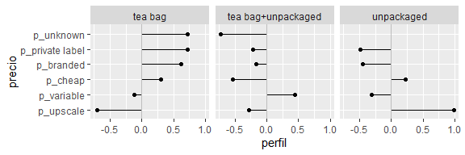

ExamenParcial
================
Bruno Gonzalez
2/10/2019

## EXAMEN PARCIAL

#### 1\. Tablas de conteos y bootstrap

En la sección de visualización vimos un ejemplo de tabla de perfiles.

En este ejercicio construiremos intervalos de confianza para una tabla
de perfiles usando bootstrap. Usaremos los datos de tomadores de te (del
paquete @factominer):

``` r
data(tea)
tea <- tea %>% 
  as_tibble %>% 
  select(how, price, sugar)
```

Nos interesa ver qué personas compran té suelto (`unpacked`), y de qué
tipo (`Tea`). Empezamos por ver las proporciones que compran té según su
empaque (en bolsita o suelto):

| how                |   n |  % |
| :----------------- | --: | -: |
| tea bag            | 170 | 57 |
| tea bag+unpackaged |  94 | 31 |
| unpackaged         |  36 | 12 |

La tabla de arriba es poco informativa, buscamos comparar grupos, por
ejemplo, queremos investigar si hay diferencias en los patrones de
compra (en términos de precio o marca) dependiendo del tipo de té que
consumen.

    ## # A tibble: 6 x 4
    ##   price           `tea bag` `tea bag+unpackaged` unpackaged
    ##   <fct>               <dbl>                <dbl>      <dbl>
    ## 1 p_branded              41                   21         14
    ## 2 p_cheap                 3                    1          3
    ## 3 p_private label         9                    4          3
    ## 4 p_unknown               6                    1          0
    ## 5 p_upscale               8                   20         56
    ## 6 p_variable             32                   52         25

Para facilitar la comparación podemos calcular *perfiles columna*.
Comparamos cada una de las columnas con la columna marginal (la tabla de
tipo de estilo de té):

<table>

<thead>

<tr>

<th style="text-align:left;">

price

</th>

<th style="text-align:right;">

tea bag

</th>

<th style="text-align:right;">

tea bag+unpackaged

</th>

<th style="text-align:right;">

unpackaged

</th>

<th style="text-align:right;">

promedio

</th>

</tr>

</thead>

<tbody>

<tr>

<td style="text-align:left;">

p\_private label

</td>

<td style="text-align:right;">

0.72

</td>

<td style="text-align:right;">

\-0.22

</td>

<td style="text-align:right;">

\-0.49

</td>

<td style="text-align:right;">

5

</td>

</tr>

<tr>

<td style="text-align:left;">

p\_unknown

</td>

<td style="text-align:right;">

0.72

</td>

<td style="text-align:right;">

\-0.72

</td>

<td style="text-align:right;">

\-1.00

</td>

<td style="text-align:right;">

4

</td>

</tr>

<tr>

<td style="text-align:left;">

p\_branded

</td>

<td style="text-align:right;">

0.62

</td>

<td style="text-align:right;">

\-0.16

</td>

<td style="text-align:right;">

\-0.45

</td>

<td style="text-align:right;">

25

</td>

</tr>

<tr>

<td style="text-align:left;">

p\_cheap

</td>

<td style="text-align:right;">

0.30

</td>

<td style="text-align:right;">

\-0.53

</td>

<td style="text-align:right;">

0.23

</td>

<td style="text-align:right;">

2

</td>

</tr>

<tr>

<td style="text-align:left;">

p\_variable

</td>

<td style="text-align:right;">

\-0.12

</td>

<td style="text-align:right;">

0.44

</td>

<td style="text-align:right;">

\-0.31

</td>

<td style="text-align:right;">

36

</td>

</tr>

<tr>

<td style="text-align:left;">

p\_upscale

</td>

<td style="text-align:right;">

\-0.71

</td>

<td style="text-align:right;">

\-0.28

</td>

<td style="text-align:right;">

0.98

</td>

<td style="text-align:right;">

28

</td>

</tr>

</tbody>

</table>

Leemos esta tabla como sigue: por ejemplo, los compradores de té suelto
(`unpacked`) compran té fino (`upscale`) a una tasa casi el doble (0.98)
que el promedio.

También podemos graficar como:

<!-- -->

**Observación**: hay dos maneras de construir la columna promedio:
tomando los porcentajes sobre todos los datos, o promediando los
porcentajes de las columnas como en este ejemplo.

1.  Utiliza bootstrap para crear intervalos de confianza sobre los
    perfiles de la última tabla.

Primero definimos la funcion bootstrap

``` r
perfiles_boot <- function(x){
  m <- sample_n(x, size =  300 , replace = TRUE)
  tabla <- m %>% 
    count(how, price) %>% 
    group_by(how) %>% 
    mutate(prop_price = (100 * n / sum(n))) %>% 
    group_by(price) %>% 
    mutate(prom_prop = mean(prop_price)) %>% 
    mutate(perfil = (prop_price / prom_prop - 1) %>% round(2))
  tabla
}
```

Despues corresmos las
repeticiones

``` r
perfiles_rep <- rerun(10000, perfiles_boot(tea)) %>% bind_rows(.id = 'muestra')
```

Posteriormente calculamos los errores estándard

``` r
perfiles_se <- perfiles_rep %>% 
  group_by(how, price) %>% 
  summarise(se = sd(perfil))
```

Por último calculamos los intervalos

``` r
perfiles_int <- tabla %>% 
  left_join(perfiles_se) %>% 
  mutate(Int_inf = perfil+qnorm(0.025)*se, Int_sup = perfil+qnorm(0.975)*se)
```

    ## Joining, by = c("how", "price")

``` r
kable(select(perfiles_int, how, price, perfil, Int_inf, Int_sup), digits = 2)
```

| how                | price            | perfil | Int\_inf | Int\_sup |
| :----------------- | :--------------- | -----: | -------: | -------: |
| tea bag            | p\_branded       |   0.62 |     0.28 |     0.96 |
| tea bag            | p\_cheap         |   0.30 |   \-0.37 |     0.97 |
| tea bag            | p\_private label |   0.72 |     0.12 |     1.32 |
| tea bag            | p\_unknown       |   0.72 |     0.10 |     1.34 |
| tea bag            | p\_upscale       | \-0.71 |   \-0.86 |   \-0.56 |
| tea bag            | p\_variable      | \-0.12 |   \-0.32 |     0.08 |
| tea bag+unpackaged | p\_branded       | \-0.16 |   \-0.44 |     0.12 |
| tea bag+unpackaged | p\_cheap         | \-0.53 |   \-1.09 |     0.03 |
| tea bag+unpackaged | p\_private label | \-0.22 |   \-0.75 |     0.31 |
| tea bag+unpackaged | p\_unknown       | \-0.72 |   \-1.08 |   \-0.36 |
| tea bag+unpackaged | p\_upscale       | \-0.28 |   \-0.55 |   \-0.01 |
| tea bag+unpackaged | p\_variable      |   0.44 |     0.18 |     0.70 |
| unpackaged         | p\_branded       | \-0.45 |   \-0.82 |   \-0.08 |
| unpackaged         | p\_cheap         |   0.23 |   \-0.52 |     0.98 |
| unpackaged         | p\_private label | \-0.49 |   \-1.05 |     0.07 |
| unpackaged         | p\_upscale       |   0.98 |     0.68 |     1.28 |
| unpackaged         | p\_variable      | \-0.31 |   \-0.63 |     0.01 |

2.  Modifica la última gráfica para representar los intervalos de
    confianza.

<!-- -->

3.  Comenta tus observaciones. En la categoria de teabag la mayor tasa
    de compra son los precios “private label y unknown” que son .72 con
    un intervalo de confianza entre .10 y 1.34. Lo cual nos indica que
    este patron de comportamiento es alto en esa categoria porque los
    usuarios de tea compran mas a estos precios y por otro lado compran
    a una tasa negativa a precio upscale.

#### 2\. Cuantificando el error Monte Carlo

Recordemos que ante la pregunta ¿cuántas muestras bootstrap se
necesitan? el error que podemos disminuir al aumentar el número de
replicaciones es el error de Monte Carlo, y una manera de cuantificarlo
es haciendo bootstrap del bootstrap.

Retomemos el ejemplo de la media de las calificaciones de ENLACE de
español 3o de primaria en el estado de México. Nos interesa la media de
las calificaciones y usaremos el estimador *plug-in*.

``` r
library(estcomp)
# universo
enlace <- enlacep_2013 %>% 
    janitor::clean_names() %>% 
    mutate(id = 1:n()) %>% 
    select(id, cve_ent, turno, tipo, esp_3 = punt_esp_3, esp_6 = punt_esp_6, 
        n_eval_3 = alum_eval_3, n_eval_6 = alum_eval_6) %>% 
    na.omit() %>% 
    filter(esp_3 > 0, esp_6 > 0, n_eval_3 > 0, n_eval_6 > 0, cve_ent == "15")
set.seed(16021)
n <- 300
# muestra
enlace_muestra <- sample_n(enlace, n) %>% 
    mutate(clase = "muestra")
```

1.  Crea un intervalo del 90% para \(\hat{\theta}\) usando los
    percentiles de la distribución bootstrap, y \(B=100\) replicaciones.

Primero creamos la función bootstrap

``` r
enlace_boot <- function(x,col){
  col <- enquo(col)
  n <- nrow(x)
  muestra <- sample_n(x,n, replace = TRUE)
  muestra %>% 
    select(!!col) %>% 
    unlist() %>% 
    median()
}
```

Posteriormente se hacen las \(B=100\) simulaciones bootstrap.

``` r
enlace_rep <- rerun(100, enlace_boot(enlace,esp_3))%>%
  flatten_dbl()
```

Por último, calculamos el intervalos usando los percentiles de la
distrubucion bootstrap.

``` r
quantile(enlace_rep, c(0.05, 0.95))
```

    ##  5% 95% 
    ## 546 549

2.  Podemos estimar el error estándar de Monte Carlo de los extremos de
    los intervalos (percentiles 0.05 y 0.95) haciendo bootstrap de la
    distribución bootstrap:

<!-- end list -->

  - Selecciona muestras con reemplazo de tamaño \(B\) de la distribución
    bootstrap,
      - Calcula los percentiles de interés (0.05 y 0.95),

Primero construimos la función bootstrap de la distribución bootstrap

``` r
enlace_boot_boot <- function(x){
  n <- length(x)
  muestra <- sample(x, size = n, replace = TRUE)
  tibble(SE_inf = quantile(muestra, c(0.025,0.975))[1], SE_sup = quantile(muestra, c(0.025,0.975))[2])
}
```

Con la función hacemos las repeticiones

``` r
enlace_boot_rep <- rerun(1000,enlace_boot_boot(enlace_rep)) %>%
  bind_rows(.id = 'muestra')
```

  - Calcula la desviación estándar de los percentiles (una para cada
    extremo), esta será tu aproximación al error de Monte Carlo

<!-- end list -->

``` r
EMC100 <- map_dbl(enlace_boot_rep, sd)
```

3.  ¿Cuál es el error estándar de Monte Carlo con
    \(B = 100, 1000, 10000\) replicaciones para cada extremo del
    intervalo de percentiles?

Para el caso de \(B = 100\)

``` r
EMC100[2:3]
```

    ##    SE_inf    SE_sup 
    ## 0.2094879 0.1596374

Para el caso de \(B = 1000\)

``` r
enlace_rep <- rerun(1000, enlace_boot(enlace,esp_3))%>%flatten_dbl()
enlace_boot_rep <- rerun(1000,enlace_boot_boot(enlace_rep)) %>%
  bind_rows(.id = 'muestra')
map_dbl(enlace_boot_rep, sd)[2:3]
```

    ##    SE_inf    SE_sup 
    ## 0.0000000 0.0890622

Para el caso de \(B = 10000\)

``` r
enlace_rep <- rerun(10000, enlace_boot(enlace,esp_3))%>%flatten_dbl()
enlace_boot_rep <- rerun(1000,enlace_boot_boot(enlace_rep)) %>%
  bind_rows(.id = 'muestra')
map_dbl(enlace_boot_rep, sd)[2:3]
```

    ##     SE_inf     SE_sup 
    ## 0.00000000 0.02234949

Las corridas muestran la que el error Monte Carlo va disminuyendo
conforme se aumentan el número de replicaciones.

#### 3\. Cobertura de intervalos de confianza

En este problema realizarás un ejercicio de simulación para comparar la
exactitud de distintos intervalos de confianza. Simularás muestras de
una distribución Poisson con parámetro \(\lambda=2.5\) y el estadístico
de interéses \(\theta=exp(-2\lambda)\).

Sigue el siguiente proceso:

1)  Genera una muestra aleatoria de tamaño \(n=60\) con distribución
    \(Poisson(\lambda)\), parámetro \(\lambda=2.5\) (en R usa la función
    `rpois()`).

2)  Genera \(10,000\) muestras bootstrap y calcula intervalos de
    confianza del 95% para \(\hat{\theta}\) usando 1) el método normal,
    2) percentiles y 3) \(BC_a\).

Primero definimos la función del parámetro

``` r
poiss_boot <- function(x, ind){
  exp(-2*mean(x[ind]))
}
```

Posteriormente definimos la funcion que genera los intervalos de
confianza

``` r
poiss_intervalos <- function(n=60) {
  poiss_muestra <- rpois(n,2.5)
  
  poiss_rep <-  boot(poiss_muestra, poiss_boot,10000)
  poiss_int <-boot.ci(poiss_rep, type = c("norm", "perc", "bca"))
  
  data.frame(metodo = c('normal','percentil','BCa'),
             theta = poiss_int$t0,
             inferior = c(poiss_int$normal[2],poiss_int$percent[4],poiss_int$bca[4]),
             superior = c(poiss_int$normal[3],poiss_int$percent[5],poiss_int$bca[5]))
}
```

Finalmente, los intervalos son:

``` r
poiss_intervalos() %>% 
  kable(digits = 4)
```

| metodo    | theta | inferior | superior |
| :-------- | ----: | -------: | -------: |
| normal    | 0.005 |   0.0003 |   0.0089 |
| percentil | 0.005 |   0.0023 |   0.0107 |
| BCa       | 0.005 |   0.0022 |   0.0101 |

3)  Revisa si el intervalo de confianza contiene el verdadero valor del
    parámetro (\(\theta=exp(-2\cdot2.5)\)), en caso de que no lo
    contenga registra si falló por la izquierda o falló por la derecha.

Los tres intervalos de confianza contienen el verdadero valor del
parámetro 0.0067379

1)  Repite el proceso descrito 1000 veces y llena la siguiente tabla:

Primero corremos las 100
repeticiones

``` r
poiss_rep_int <- rerun(1000, poiss_intervalos()) %>% bind_rows(.id = 'muestra')
```

Posteriormente calculamos los fallos y combertura

``` r
poiss_rep_int <- poiss_rep_int %>% 
  mutate(fallo_izquierda = exp(-2*2.5)<inferior,
         fallo_derecha = exp(-2*2.5)>superior,
         Longitud = superior-inferior)
```

Así tenemos la siguiente tabla:

``` r
poiss_rep_int %>% 
  group_by(metodo) %>% 
  summarise(P_fallo_izquierda = sum(fallo_izquierda)/n(),
            P_fallo_derecha = sum(fallo_derecha)/n(),
            Cobertura = 1 - P_fallo_izquierda - P_fallo_derecha,
            Longitud_promedio = mean(Longitud)) %>% 
  kable()
```

| metodo    | P\_fallo\_izquierda | P\_fallo\_derecha | Cobertura | Longitud\_promedio |
| :-------- | ------------------: | ----------------: | --------: | -----------------: |
| BCa       |               0.021 |             0.022 |     0.957 |          0.0117646 |
| normal    |               0.000 |             0.058 |     0.942 |          0.0126198 |
| percentil |               0.027 |             0.014 |     0.959 |          0.0123914 |

La columna cobertura es una estimación de la cobertura del intervalo
basada en las simulaciones, para calcularla simplemente escribe el
porcentaje de los intervalos que incluyeron el verdadero valor del
parámetro. La longitud promedio es la longitud promedio de los
intervalos de confianza bajo cada método.

2)  Realiza una gráfica de páneles, en cada panel mostrarás los
    resultados de uno de los métodos (normal, percentiles y BC\_a), en
    el vertical graficarás los límites de los intervalos.

<!-- end list -->

``` r
  ggplot(poiss_rep_int) +
    geom_pointrange(aes(x = reorder(muestra,theta),
                        ymin = inferior,
                        y=theta,
                        ymax = superior),
                    size=0.2) +
    geom_hline(yintercept = exp(-2.5*2)) +
    facet_grid(metodo~.)
```

<!-- -->

3)  Repite los incisos a) y b) seleccionando muestras de tamaño \(300\).

Primero hacemos las repeticiones con el tamano de muestra 300.

``` r
poiss_rep_int_300 <- rerun(1000, poiss_intervalos(300))%>%
  bind_rows(.id = 'muestra') %>% 
  mutate(fallo_izquierda = exp(-2*2.5)<inferior,
         fallo_derecha = exp(-2*2.5)>superior,
         Longitud = superior-inferior)
```

Así obtenemos la siguiente tabla:

``` r
poiss_rep_int_300 %>% 
  group_by(metodo) %>% 
  summarise(P_fallo_izquierda = sum(fallo_izquierda)/n(),
            P_fallo_derecha = sum(fallo_derecha)/n(),
            Cobertura = 1 - P_fallo_izquierda - P_fallo_derecha,
            Longitud_promedio = mean(Longitud))%>% 
  kable()
```

| metodo    | P\_fallo\_izquierda | P\_fallo\_derecha | Cobertura | Longitud\_promedio |
| :-------- | ------------------: | ----------------: | --------: | -----------------: |
| BCa       |               0.020 |             0.030 |     0.950 |          0.0049177 |
| normal    |               0.005 |             0.050 |     0.945 |          0.0049909 |
| percentil |               0.026 |             0.027 |     0.947 |          0.0049767 |

Y la siguiente gráfica:

``` r
  ggplot(poiss_rep_int_300) +
    geom_pointrange(aes(x = reorder(muestra,theta),
                        ymin = inferior,
                        y=theta,
                        ymax = superior),
                    size=0.2) +
    geom_hline(yintercept = exp(-2.5*2)) +
    facet_grid(metodo~.)
```

<!-- -->
