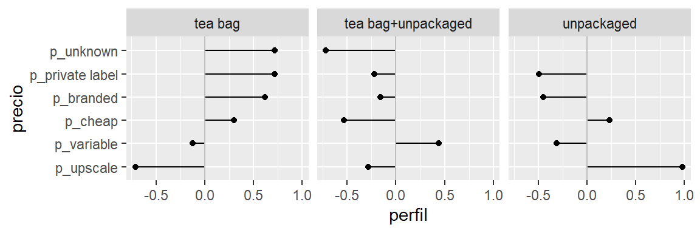
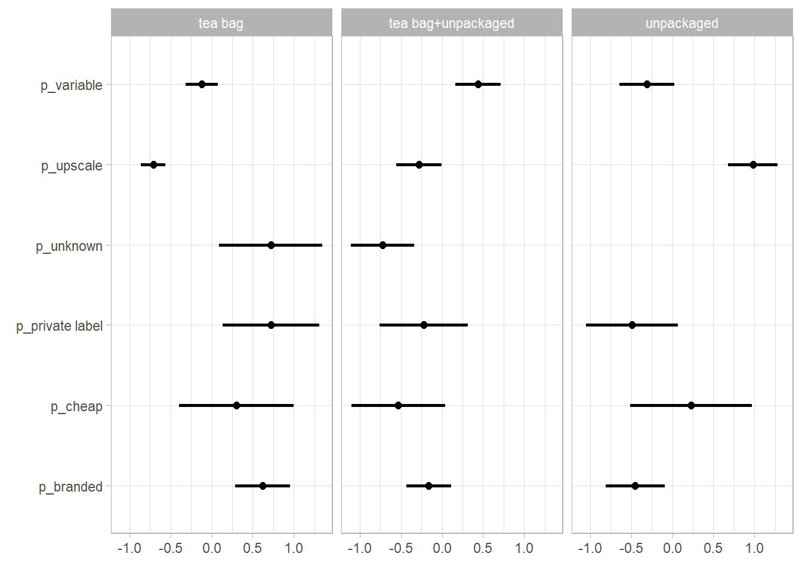

## EXAMEN PARCIAL


#### 1. Tablas de conteos y bootstrap {-}

En la sección de visualización vimos un ejemplo de tabla de perfiles.

En este ejercicio construiremos intervalos de confianza para una tabla de perfiles usando bootstrap. Usaremos los datos de tomadores de te (del paquete @factominer):


```r
data(tea)
tea <- tea %>% 
  as_tibble %>% 
  select(how, price, sugar)
```

Nos interesa ver qué personas compran té suelto (`unpacked`), y de qué tipo (`Tea`). Empezamos por ver las proporciones que compran té según su empaque (en bolsita o suelto):


how                     n    %
-------------------  ----  ---
tea bag               170   57
tea bag+unpackaged     94   31
unpackaged             36   12

La tabla de arriba es poco informativa, buscamos comparar grupos, por ejemplo, queremos investigar si hay diferencias en los patrones de compra (en términos de precio o marca) dependiendo del tipo de té que consumen.

<table class="table table-striped table-hover table-condensed table-responsive" style="font-size: 15px; width: auto !important; margin-left: auto; margin-right: auto;">
 <thead>
  <tr>
   <th style="text-align:left;position: sticky; top:0; background-color: #FFFFFF;"> price </th>
   <th style="text-align:right;position: sticky; top:0; background-color: #FFFFFF;"> tea bag </th>
   <th style="text-align:right;position: sticky; top:0; background-color: #FFFFFF;"> tea bag+unpackaged </th>
   <th style="text-align:right;position: sticky; top:0; background-color: #FFFFFF;"> unpackaged </th>
  </tr>
 </thead>
<tbody>
  <tr>
   <td style="text-align:left;"> p_branded </td>
   <td style="text-align:right;"> 41 </td>
   <td style="text-align:right;"> 21 </td>
   <td style="text-align:right;"> 14 </td>
  </tr>
  <tr>
   <td style="text-align:left;"> p_cheap </td>
   <td style="text-align:right;"> 3 </td>
   <td style="text-align:right;"> 1 </td>
   <td style="text-align:right;"> 3 </td>
  </tr>
  <tr>
   <td style="text-align:left;"> p_private label </td>
   <td style="text-align:right;"> 9 </td>
   <td style="text-align:right;"> 4 </td>
   <td style="text-align:right;"> 3 </td>
  </tr>
  <tr>
   <td style="text-align:left;"> p_unknown </td>
   <td style="text-align:right;"> 6 </td>
   <td style="text-align:right;"> 1 </td>
   <td style="text-align:right;"> 0 </td>
  </tr>
  <tr>
   <td style="text-align:left;"> p_upscale </td>
   <td style="text-align:right;"> 8 </td>
   <td style="text-align:right;"> 20 </td>
   <td style="text-align:right;"> 56 </td>
  </tr>
  <tr>
   <td style="text-align:left;"> p_variable </td>
   <td style="text-align:right;"> 32 </td>
   <td style="text-align:right;"> 52 </td>
   <td style="text-align:right;"> 25 </td>
  </tr>
</tbody>
</table>

Para facilitar la comparación podemos calcular *perfiles columna*. Comparamos cada una de las columnas con la columna marginal (la tabla de tipo de estilo de té):


<table class="table table-hover table-condensed" style="width: auto !important; margin-left: auto; margin-right: auto;">
 <thead>
  <tr>
   <th style="text-align:left;"> price </th>
   <th style="text-align:left;"> tea bag </th>
   <th style="text-align:left;"> tea bag+unpackaged </th>
   <th style="text-align:left;"> unpackaged </th>
   <th style="text-align:right;"> promedio </th>
  </tr>
 </thead>
<tbody>
  <tr>
   <td style="text-align:left;"> p_private label </td>
   <td style="text-align:left;"> <span style="     color: black !important;">0.72</span> </td>
   <td style="text-align:left;"> <span style="     color: lightgray !important;">-0.22</span> </td>
   <td style="text-align:left;"> <span style="     color: red !important;">-0.49</span> </td>
   <td style="text-align:right;"> 5 </td>
  </tr>
  <tr>
   <td style="text-align:left;"> p_unknown </td>
   <td style="text-align:left;"> <span style="     color: black !important;">0.72</span> </td>
   <td style="text-align:left;"> <span style="     color: red !important;">-0.72</span> </td>
   <td style="text-align:left;"> <span style="     color: red !important;">-1</span> </td>
   <td style="text-align:right;"> 4 </td>
  </tr>
  <tr>
   <td style="text-align:left;"> p_branded </td>
   <td style="text-align:left;"> <span style="     color: black !important;">0.62</span> </td>
   <td style="text-align:left;"> <span style="     color: lightgray !important;">-0.16</span> </td>
   <td style="text-align:left;"> <span style="     color: red !important;">-0.45</span> </td>
   <td style="text-align:right;"> 25 </td>
  </tr>
  <tr>
   <td style="text-align:left;"> p_cheap </td>
   <td style="text-align:left;"> <span style="     color: black !important;">0.3</span> </td>
   <td style="text-align:left;"> <span style="     color: red !important;">-0.53</span> </td>
   <td style="text-align:left;"> <span style="     color: lightgray !important;">0.23</span> </td>
   <td style="text-align:right;"> 2 </td>
  </tr>
  <tr>
   <td style="text-align:left;"> p_variable </td>
   <td style="text-align:left;"> <span style="     color: lightgray !important;">-0.12</span> </td>
   <td style="text-align:left;"> <span style="     color: black !important;">0.44</span> </td>
   <td style="text-align:left;"> <span style="     color: red !important;">-0.31</span> </td>
   <td style="text-align:right;"> 36 </td>
  </tr>
  <tr>
   <td style="text-align:left;"> p_upscale </td>
   <td style="text-align:left;"> <span style="     color: red !important;">-0.71</span> </td>
   <td style="text-align:left;"> <span style="     color: red !important;">-0.28</span> </td>
   <td style="text-align:left;"> <span style="     color: black !important;">0.98</span> </td>
   <td style="text-align:right;"> 28 </td>
  </tr>
</tbody>
</table>

Leemos esta tabla como sigue: por ejemplo, los compradores de té suelto (`unpacked`) compran té fino (`upscale`) a una tasa casi el doble (0.98) que el promedio. 

También podemos graficar como:



**Observación**: hay dos maneras de construir la columna promedio: tomando los porcentajes sobre todos los datos, o promediando los porcentajes de las columnas como en este ejemplo.

1. Utiliza bootstrap para crear intervalos de confianza sobre los perfiles de la última tabla.

Primero definimos la funcion bootstrap


```r
perfiles_boot <- function(x){
  m <- sample_n(x, size =  300 , replace = TRUE)
  tabla <- m %>% 
    count(how, price) %>% 
    group_by(how) %>% 
    mutate(prop_price = (100 * n / sum(n))) %>% 
    group_by(price) %>% 
    mutate(prom_prop = mean(prop_price)) %>% 
    mutate(perfil = (prop_price / prom_prop - 1) %>% round(2))
  tabla
}
```

Despues corresmos las repeticiones


```r
perfiles_rep <- rerun(1000, perfiles_boot(tea)) %>% map_dfr(~.x)
```

Posteriormente calculamos los errores estándard


```r
perfiles_se <- perfiles_rep %>% 
  group_by(how, price) %>% 
  summarise(se = sd(perfil))
```

Por último calculamos los intervalos


```r
perfiles_int <- tabla %>% 
  left_join(perfiles_se) %>% 
  mutate(Int_inf = perfil+qnorm(0.025)*se, Int_sup = perfil+qnorm(0.975)*se)
```

```
## Joining, by = c("how", "price")
```

```r
kable(select(perfiles_int, how, price, perfil, Int_inf, Int_sup), digits = 2)
```

<table>
 <thead>
  <tr>
   <th style="text-align:left;"> how </th>
   <th style="text-align:left;"> price </th>
   <th style="text-align:right;"> perfil </th>
   <th style="text-align:right;"> Int_inf </th>
   <th style="text-align:right;"> Int_sup </th>
  </tr>
 </thead>
<tbody>
  <tr>
   <td style="text-align:left;"> tea bag </td>
   <td style="text-align:left;"> p_branded </td>
   <td style="text-align:right;"> 0.62 </td>
   <td style="text-align:right;"> 0.28 </td>
   <td style="text-align:right;"> 0.96 </td>
  </tr>
  <tr>
   <td style="text-align:left;"> tea bag </td>
   <td style="text-align:left;"> p_cheap </td>
   <td style="text-align:right;"> 0.30 </td>
   <td style="text-align:right;"> -0.40 </td>
   <td style="text-align:right;"> 1.00 </td>
  </tr>
  <tr>
   <td style="text-align:left;"> tea bag </td>
   <td style="text-align:left;"> p_private label </td>
   <td style="text-align:right;"> 0.72 </td>
   <td style="text-align:right;"> 0.13 </td>
   <td style="text-align:right;"> 1.31 </td>
  </tr>
  <tr>
   <td style="text-align:left;"> tea bag </td>
   <td style="text-align:left;"> p_unknown </td>
   <td style="text-align:right;"> 0.72 </td>
   <td style="text-align:right;"> 0.09 </td>
   <td style="text-align:right;"> 1.35 </td>
  </tr>
  <tr>
   <td style="text-align:left;"> tea bag </td>
   <td style="text-align:left;"> p_upscale </td>
   <td style="text-align:right;"> -0.71 </td>
   <td style="text-align:right;"> -0.86 </td>
   <td style="text-align:right;"> -0.56 </td>
  </tr>
  <tr>
   <td style="text-align:left;"> tea bag </td>
   <td style="text-align:left;"> p_variable </td>
   <td style="text-align:right;"> -0.12 </td>
   <td style="text-align:right;"> -0.32 </td>
   <td style="text-align:right;"> 0.08 </td>
  </tr>
  <tr>
   <td style="text-align:left;"> tea bag+unpackaged </td>
   <td style="text-align:left;"> p_branded </td>
   <td style="text-align:right;"> -0.16 </td>
   <td style="text-align:right;"> -0.43 </td>
   <td style="text-align:right;"> 0.11 </td>
  </tr>
  <tr>
   <td style="text-align:left;"> tea bag+unpackaged </td>
   <td style="text-align:left;"> p_cheap </td>
   <td style="text-align:right;"> -0.53 </td>
   <td style="text-align:right;"> -1.10 </td>
   <td style="text-align:right;"> 0.04 </td>
  </tr>
  <tr>
   <td style="text-align:left;"> tea bag+unpackaged </td>
   <td style="text-align:left;"> p_private label </td>
   <td style="text-align:right;"> -0.22 </td>
   <td style="text-align:right;"> -0.76 </td>
   <td style="text-align:right;"> 0.32 </td>
  </tr>
  <tr>
   <td style="text-align:left;"> tea bag+unpackaged </td>
   <td style="text-align:left;"> p_unknown </td>
   <td style="text-align:right;"> -0.72 </td>
   <td style="text-align:right;"> -1.10 </td>
   <td style="text-align:right;"> -0.34 </td>
  </tr>
  <tr>
   <td style="text-align:left;"> tea bag+unpackaged </td>
   <td style="text-align:left;"> p_upscale </td>
   <td style="text-align:right;"> -0.28 </td>
   <td style="text-align:right;"> -0.56 </td>
   <td style="text-align:right;"> 0.00 </td>
  </tr>
  <tr>
   <td style="text-align:left;"> tea bag+unpackaged </td>
   <td style="text-align:left;"> p_variable </td>
   <td style="text-align:right;"> 0.44 </td>
   <td style="text-align:right;"> 0.17 </td>
   <td style="text-align:right;"> 0.71 </td>
  </tr>
  <tr>
   <td style="text-align:left;"> unpackaged </td>
   <td style="text-align:left;"> p_branded </td>
   <td style="text-align:right;"> -0.45 </td>
   <td style="text-align:right;"> -0.81 </td>
   <td style="text-align:right;"> -0.09 </td>
  </tr>
  <tr>
   <td style="text-align:left;"> unpackaged </td>
   <td style="text-align:left;"> p_cheap </td>
   <td style="text-align:right;"> 0.23 </td>
   <td style="text-align:right;"> -0.51 </td>
   <td style="text-align:right;"> 0.97 </td>
  </tr>
  <tr>
   <td style="text-align:left;"> unpackaged </td>
   <td style="text-align:left;"> p_private label </td>
   <td style="text-align:right;"> -0.49 </td>
   <td style="text-align:right;"> -1.05 </td>
   <td style="text-align:right;"> 0.07 </td>
  </tr>
  <tr>
   <td style="text-align:left;"> unpackaged </td>
   <td style="text-align:left;"> p_upscale </td>
   <td style="text-align:right;"> 0.98 </td>
   <td style="text-align:right;"> 0.68 </td>
   <td style="text-align:right;"> 1.28 </td>
  </tr>
  <tr>
   <td style="text-align:left;"> unpackaged </td>
   <td style="text-align:left;"> p_variable </td>
   <td style="text-align:right;"> -0.31 </td>
   <td style="text-align:right;"> -0.65 </td>
   <td style="text-align:right;"> 0.03 </td>
  </tr>
</tbody>
</table>


2. Modifica la última gráfica para representar los intervalos de confianza.


```r
ggplot(perfiles_int) +
  geom_segment(aes(y = price, yend = price, x = Int_inf, xend = Int_sup), size = 1) +
  geom_point(aes(x = perfil, y = price), size = 2) +
  facet_wrap(how~.) +
  labs(x = element_blank(),
       y = element_blank()) +
  theme_light()
```



3. Comenta tus observaciones.


#### 2. Cuantificando el error Monte Carlo {-}

Recordemos que ante la pregunta ¿cuántas muestras bootstrap se necesitan? el error que podemos disminuir al aumentar el número de replicaciones es el error de Monte Carlo, y una manera de cuantificarlo es haciendo bootstrap del bootstrap.

Retomemos el ejemplo de la media de las calificaciones de ENLACE de español 3o de primaria en el estado de México. Nos interesa la media de las calificaciones y usaremos el estimador *plug-in*.


```r
library(estcomp)
# universo
enlace <- enlacep_2013 %>% 
    janitor::clean_names() %>% 
    mutate(id = 1:n()) %>% 
    select(id, cve_ent, turno, tipo, esp_3 = punt_esp_3, esp_6 = punt_esp_6, 
        n_eval_3 = alum_eval_3, n_eval_6 = alum_eval_6) %>% 
    na.omit() %>% 
    filter(esp_3 > 0, esp_6 > 0, n_eval_3 > 0, n_eval_6 > 0, cve_ent == "15")
set.seed(16021)
n <- 300
# muestra
enlace_muestra <- sample_n(enlace, n) %>% 
    mutate(clase = "muestra")
```

1. Crea un intervalo del 90% para $\hat{\theta}$ usando los percentiles de la distribución bootstrap, y $B=100$ replicaciones.

Primero creamos la función bootstrap


```r
enlace_boot <- function(x,col){
  col <- enquo(col)
  n <- nrow(x)
  muestra <- sample_n(x,n, replace = TRUE)
  muestra %>% 
    select(!!col) %>% 
    unlist() %>% 
    median()
}
```

Posteriormente se hacen las $B=100$ simulaciones bootstrap.


```r
enlace_rep <- rerun(100, enlace_boot(enlace,esp_3))%>%
  flatten_dbl()
```

Por último, calculamos el intervalos usando los percentiles de la distrubucion bootstrap.

```r
quantile(enlace_rep, c(0.025, 0.975))
```

```
##  2.5% 97.5% 
##   546   549
```


2. Podemos estimar el error estándar de Monte Carlo de los extremos de los intervalos (percentiles 0.05 y 0.95) haciendo bootstrap de la distribución bootstrap:
  + Selecciona muestras con reemplazo de tamaño $B$ de la distribución bootstrap,
  + Calcula los percentiles de interés (0.05 y 0.95),
  
Primero construimos la función bootstrap de la distribución bootstrap

```r
enlace_boot_boot <- function(x){
  n <- length(x)
  muestra <- sample(x, size = n, replace = TRUE)
  tibble(SE_inf = quantile(muestra, c(0.025,0.975))[1], SE_sup = quantile(muestra, c(0.025,0.975))[2])
}
```

Con la función hacemos las repeticiones


```r
enlace_boot_rep <- rerun(1000,enlace_boot_boot(enlace_rep)) %>% map_dfr(~.x)
```


  + Calcula la desviación estándar de los percentiles (una para cada extremo), esta será tu aproximación al error de Monte Carlo

```r
EMC100 <- map_dbl(enlace_boot_rep, sd)
```


3. ¿Cuál es el error estándar de Monte Carlo con $B = 100, 1000, 10000$ replicaciones para cada extremo del intervalo de percentiles?

Para el caso de $B = 100$


```r
EMC100
```

```
##    SE_inf    SE_sup 
## 0.2094879 0.1596374
```

Para el caso de $B = 1000$

```r
enlace_rep <- rerun(1000, enlace_boot(enlace,esp_3))%>%flatten_dbl()
enlace_boot_rep <- rerun(1000,enlace_boot_boot(enlace_rep)) %>% map_dfr(~.x)
map_dbl(enlace_boot_rep, sd)
```

```
##    SE_inf    SE_sup 
## 0.0000000 0.0890622
```

Para el caso de $B = 10000$

```r
enlace_rep <- rerun(10000, enlace_boot(enlace,esp_3))%>%flatten_dbl()
enlace_boot_rep <- rerun(1000,enlace_boot_boot(enlace_rep)) %>% map_dfr(~.x)
map_dbl(enlace_boot_rep, sd)
```

```
##     SE_inf     SE_sup 
## 0.00000000 0.02234949
```
